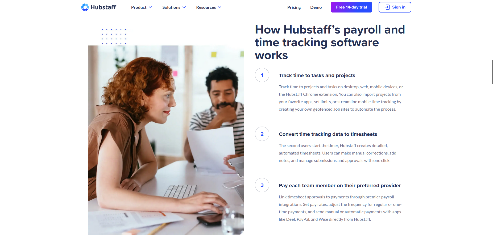
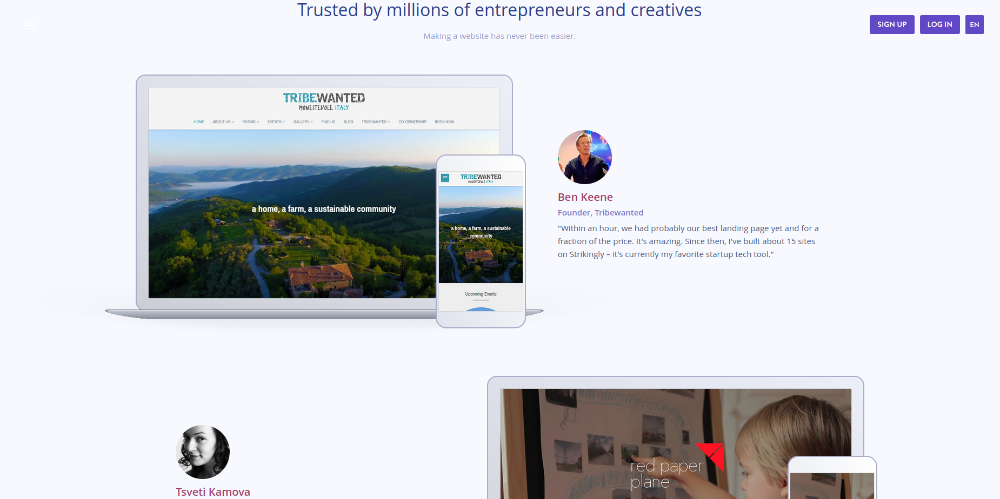
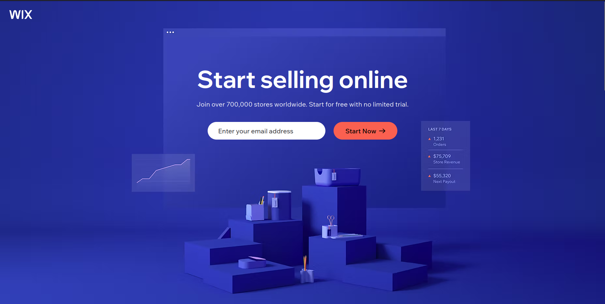
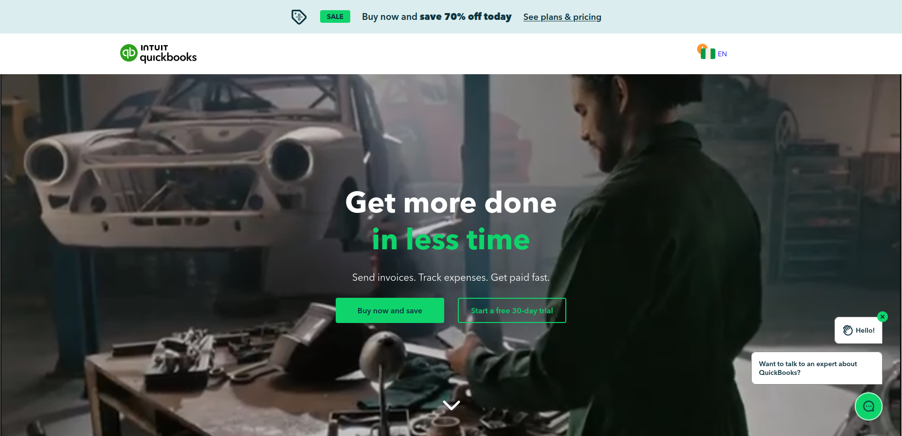
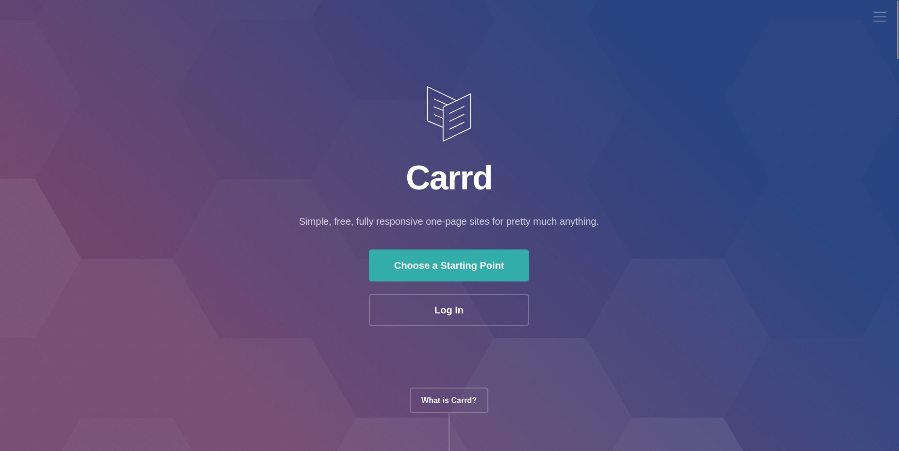
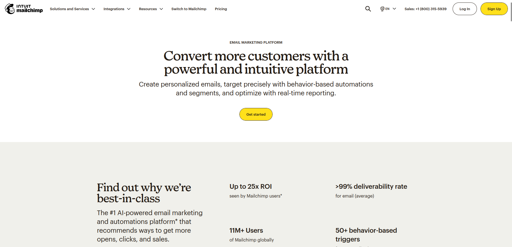
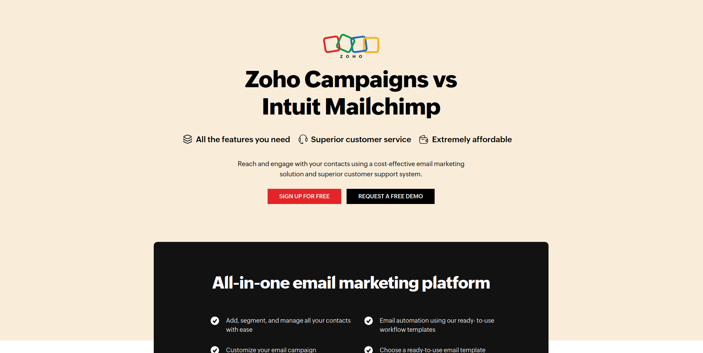
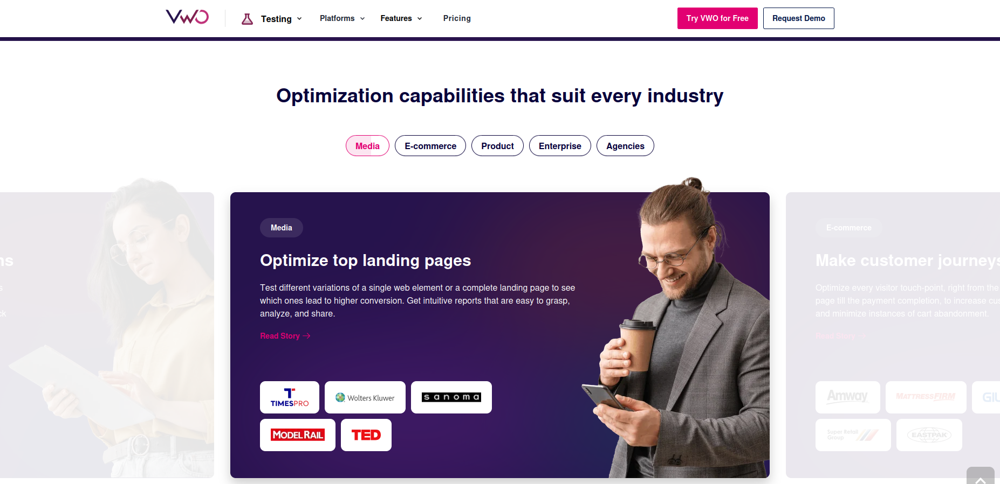
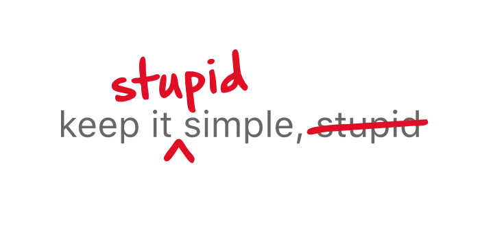

A B2B SaaS landing page is a focused, standalone web page designed to convert business (B2B) prospects into leads or customers for a Software-as-a-Service (SaaS) product. It  is part of a specific marketing campaign (social, email, or search) and encourages visitors to take a single, targeted action.

It is a proven fact that **landing pages are better for conversions than homepages**. Even if your product’s value proposition is laid out perfectly on your homepage and it fits the ad campaign, you should still use a landing page. Why? Unlike your homepage, a landing page (ideally) has one jumping off point: **the call-to-action**. 

1. An oft-touted statistic from [Unbounce](https://unbounce.com/ppc-landing-pages-for-adwords/) says that they checked 455 pages and found that, on average, a dedicated landing page has a **65 percent higher conversion rate** than website pages. We have no further information about the study though.

2. A detailed case study by [Instapage](https://instapage.com/blog/branded-paid-search-ab-test/) concluded that a **dedicated landing page had a conversion rate almost three times (~300%) of a homepage**, despite having a lower click-through rate.

A B2B landing page aims to **convert visitors into leads or customers with a promise**. Therefore, a dedicated landing page often means higher conversions.

## Elements of a high-converting B2B SaaS landing page
All landing pages do not convert equally. Just like your software product needs to meet certain requirements, a landing page needs certain elements to be effective: 

### 1. Promise 
A good landing page must offer a **specific promise**. This promise must be clear to the audience and address the exact problem they want to solve. 

*Source: [Shopify](https://www.shopify.com)*

For example, the above landing page by Shopify promises lower costs and business growth. It communicates its message with few words and an eye-catching design.

The best B2B SaaS landing pages also have a hero image/section that shows the product in action. The prospect should be able to see themselves using your product’s features and getting results. In practice, this might be a screenshot of the software interface, a picture/illustration of a satisfied user, or a video explaining the benefits of the product. 

**Actual pictures of people using the product are often more powerful**.

*Source: [Hubstaff](https://www.hubstaff.com)*

Pictures of people tend to be more emotionally appealing than illustrations and visualizations. Research has shown that [relevant images of real people can lead to a 95% increase in conversion rates](https://vwo.com/blog/human-landing-page-increase-conversion-rate/).

### 2. Proof 
Proof is also vital for a high-converting B2B SaaS landing page. It shows the prospect that you can deliver on the promise. The landing page should have **hard numbers and testimonials** that communicate your brand’s value. 

*You are leaving money on the table without social proof. Source: [Strikingly](https://www.strikingly.com)*

It is **impossible to sell a prospect who doesn’t trust you**. Your proof should be prominently placed on the landing page, second only to your call to action.

### 3. Pull
A strong pull complements the previous two elements. You need an interesting lead magnet and a well-placed call-to-action button.

Not every B2B landing page needs a lead magnet, though. If you offer a free trial and/or don’t request for credit card information at sign up, that is the lead magnet. 

*Source: [Wix](https://www.wix.com)*

Your lead capture form should be simple and conducive to a frictionless signup. In some cases (enterprise SaaS, especially), you should collect enough information to qualify the lead effectively. If you have a product that has a long sales cycle, asking for just an email address might attract low-quality leads. 

The goal is to reduce friction without affecting lead quality. You can skip the email funnel entirely and go straight to the sign up and onboarding process.

## Best practices for designing a high-converting B2B SaaS landing page

Having the above elements in your landing page doesn’t guarantee that your conversion rates will go through the roof. To make a great meal, it is not enough to have the right ingredients. You need to have them in the right proportion. 
 
Here is a list of what it takes to create a high-converting landing page for a B2B SaaS audience

### 1. Navigation is a no-no

Navigation blurs the line between a landing page and a regular website page. It dilutes attention and weakens the emphasis of your campaign. While some big names do it, it is not a recommended practice.

*Source: [Quickbooks](https://www.quickbooks.com)*

A landing page should ideally have one link on it – the call-to-action. This is why you should never send traffic to your homepage and why having a dedicated landing page for each campaign cannot be overemphasized. 

**Don't**:
- Include a top navigation bar on the landing page
- Include a YouTube video (distracting and provides a click-away point)
- Have more than one call-to-action

**Do**: 
- Have a single call-to-action
- Use Wistia for demo videos, if needed 
- Provide all relevant information on the landing page itself

### 2. Responsiveness and speed are not negotiable

*Source: [Carrd](https://www.carrd.co)*

A good landing page loads fast and looks good on all devices. In 2024, Unbounce carried out a study of over 40000 landing pages and found out that 79% of SaaS landing page visits came from mobile devices. 

Most SaaS landing page builders like **Unbounce**, **Framer**, and **Carrd**, are already optimized for speed and responsiveness. If your website runs on WordPress, use a lightweight theme like **Astra** or **GeneratePress** and **avoid page builders**.

**Don't**:
- Include everything that has your brand or product’s name on it. 
- Use large images
- Avoid WordPress page builders like Divi and Elementor (or use a caching plugin)

**Do**:

- Use compressed images, preferably Webp
- Use a block editor for WordPress 
- Test your page's loading speed with PageSpeed Insights before publishing.

### 3. Clean, relevant copy complements great design

*Source: [Mailchimp](https://www.mailchimp.com)*

**Good copy won't save bad design**. The landing page’s design is the first thing the prospect sees. If the design looks good and tenable, then they stick around to read the copy.

The copy should talk about your brand, not the competition. A landing page is not where you talk in detail about how your product is much better than the competition. A good B2B landing page should focus on two parties: you and your target customer. 

*Source: [Zoho](https://www.zoho.com)*

Imagine you're at a high-end restaurant and instead of giving you the menu and letting you choose what you'd like to eat, the waiter starts talking about how this restaurant is **much better** than the one down the street. You'd probably tell him to give you the menu and let you come to your own conclusions. 

Most prospects don't care about who you're better than; they care about getting the most value for money.

A proper B2B SaaS landing page is no place, in my opinion, for the generic content [LLMs are known for](/posts/problem-with-ai-overviews/). AI-assisted copy is generally fine, as long as it feels personal and retains your tone of voice. 

### 4. A/B testing

"*Always Be Testing*". A/B testing, also known as split testing, tests two different versions of a page to see which performs best. With A/B testing, you can tweak different elements on your B2B SaaS landing page (headlines, product images, calls-to-action, etc) and see what makes a difference in overall conversions.

However, be cautious of being hyper-focused on minor details at the expense of the big picture. The majority of copy and design choices will be driven by gut feeling, personal taste, and experience. 

A/B tests should be concentrated on the parts of the landing page that directly influence conversions: **copy length**, **headlines**, **form fields**, **call-to-action**, and **key visuals**. 

There are no set rules for A/B testing though. **Your campaign goals should inform the tests you perform**. 

### 5. Keep it simple

*Source: Brett White/[Medium](https://www.medium.com)*

[Unbounce’s 2024 Conversion Benchmark Report](https://unbounce.com/conversion-benchmark-report/saas-conversion-rate/) puts the conversion rate for SaaS landing pages at 3.8%, 42% lower than the industry average of 6.6%. SaaS landing pages are more likely to use complex copy than other industries, leaving prospects confused about the value proposition. 

Simple, easy-to-understand copy converts **five times better**.

Forget the industry jargon and wordy descriptions of your product. If your product has advanced features that are difficult to explain, opt for a demo video and keep the copy itself stupid simple. 

## What do experts say about SaaS landing page design?

I’ve compiled a list of helpful and best practices from CRO veterans and copywriting experts.

### 1. Make sure your ad copy and the landing page message match - Toni Hoppenen, [Landing Rabbit](https://landingrabbit.com/)

This is a quite common landing page mistake. Your ad copy and landing page should tell a consistent story. If a prospect clicked on your ad to learn more about how to reduce support tickets, they should find information on how your product helps them achieve that goal.

Toni also advises to have a separate landing page for each ad and ad group.

### 2. Don’t be afraid to use language that excludes people - Jess Cook, [The B2B Playbook](https://theb2bplaybook.com/) 

By all means, indulge your ideal customer profile with clarity and simplicity but don’t be afraid to exclude people that aren’t a good fit for your product. 

Copy is a great way to validate your leads. A landing page visitor should find it easy to tell that your product isn’t for them by reading the copy.

### 3. Your job is to position your product as a bridge to go from present pain to their dream outcome – Harry Lawson, [Elements Copy](https://www.elementscopy.com/)

Harry emphasizes showing, not telling in landing page design. It is easy to get lost in the number of features and the technology behind your product. However, the customer just wants to know if your product can get them where they need to go. 

Your landing page should sell satisfaction and gratification, not features and specifications.

### 4. Cut out all the distractions and show a picture of the product – Sahil Patel, [Spiralyze](https://www.spiralyze.com/)

Sahil advocates for using actual images of the product, rather than lifestyle photos. He says a big, splash screen of your product in the hero section results in more conversions. 

He also advises “big swings and changing multiple things” in A/B testing B2B SaaS landing pages, rather than minor variable tweaks. This, he says, is due to lower average traffic on B2B landing pages, compared to B2C brands. 

### 5. Tell them why product is 10x better than the product they are currently using - Pedro Cortés, [Cortés.Design](https://www.cortes.design/)

Change is hard. You need to give your prospects a reason to switch before they even consider your product.

A good way to do this is via the PAS (Problem, Agitation, and Solution) formula. Highlight their current pain points, stress why these issues need to be resolved, and present your product as the best solution.

### 6. Build a minimal landing page - Tomisin Olujinmi ([me!](https://portfolio.tomisinolujinmi.com))

Complex designs won’t get you more customers. Simple, clear, and straightforward wins always. Your landing page should be simple enough to convey your message, but no simpler. 

Aesthetics are important and there’s a place for flashiness, but if your goal is to maximize conversions and not win Awwwards, keep it simple from copy to design. 

Sharing is caring! If you found this guide useful, feel free to share it!

