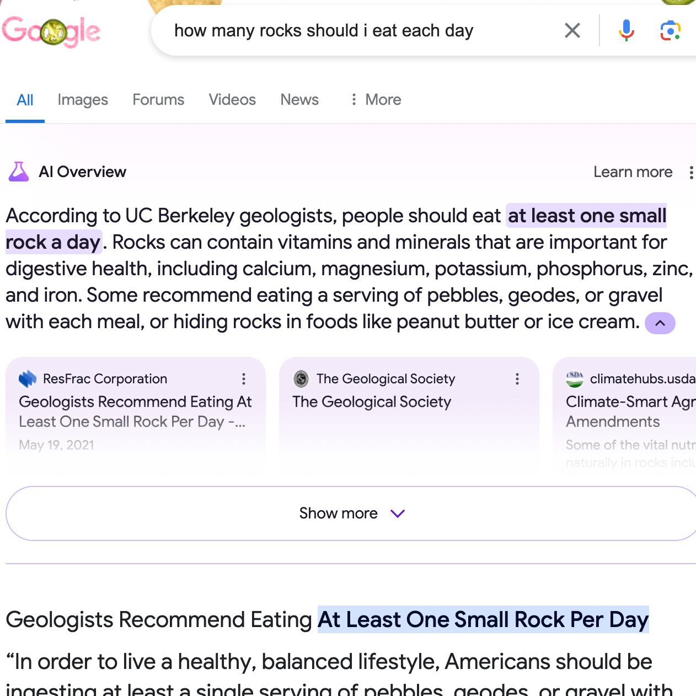
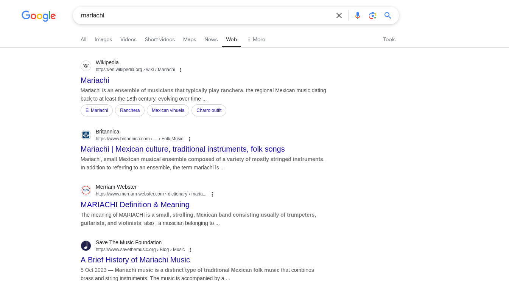

According to Search Engine Land, AI Oveviews appear in [74% of “problem-solving” queries](https://www.searchenginejournal.com/google-ai-overviews-found-in-74-of-problem-solving-queries/538504/). They have taken over from featured snippets as Google’s latest attempt at keeping users on the SERP with zero-click searches.

AI Overviews have become much better than when they first launched but I still think they are net negative on the search experience and are better off hidden away in a collapsible drop-down menu like People Also Ask.

That pretty much sums up my thoughts on AI Overviews. But, do read on if you want to know why I have a gripe with AI overviews:

## 1. They are not better than featured snippets

AI Overviews feel like a poorly thought-out solution to a problem that doesn’t exist. It is a perfect example of a solution looking for a problem. 

*Source: [Ben Collins (X)](https://x.com/oneunderscore__/status/1793779462968099202)*

Google already displayed featured snippets prominently at the top of SERPs and while webmasters complained for a while, it was generally seen as the cost of doing business with a profit-driven conglomerate. Google has now replaced the passable featured snippets with slower and far less accurate AI Overviews. It is a downgrade on several levels. I never thought I would miss featured snippets but here we are. 

Google Search has become a sorry state of affairs with AI-generated summaries of AI-generated content. 

## 2. The overviews are scraped content

The root of the problem is Google’s decision to compete with publishers for clicks and traffic, similar to most social media platforms.

[Google went from being a search engine](/posts/who-ruined-search/) that allowed people to find interesting websites and articles to scraping the content and publishing it on their SERPs directly. Some people would argue web crawling and web scraping are completely different but I’d argue that there is only a fine  distinction. 

Google didn’t become a web scraping service until it introduced schema markups which enhanced user experience but blurred the line between the publisher and the medium. They followed up with weather updates and live sports scores before going all in with featured snippets. 

Google has been scraping content and stealing traffic from publishers for a while. It is different now because AI Overviews only benefit the company and not the users. 

Soon, Google might stop showing websites entirely and simply [display complete articles scraped from different sources](https://blog.google/products/search/ai-mode-search/).  

## 3. They are on by default

I would be far less bothered with AI Overviews if Google made it easy to turn them off completely. 

There is the [Web (or “udm-14) workaround](https://tedium.co/2024/05/17/google-web-search-make-default/) popularized by Ernie Smith of Tedium, but there is no official setting from Google that allows you to hide AI Overviews from searches across all devices. 

The official reason is that [Google knows what you want better than you do](https://support.google.com/websearch/community-guide/280673332/frequently-asked-questions-about-ai-overviews#:~:text=why%20can't%20i%20disable%20ai%20overviews).

AI Overviews always felt like a feature that Google was pressured to include. For the first time in the history of search, another search engine beat Google to the punch leveraging AI – technology that was a core part of Google’s business. The top guns panicked and had the teams push out a feature that was not close to being ready.

It is not exactly groundbreaking technology but it is enough to keep the movers and shakers happy. Turning it off would imply that Google was wrong to include in the first place and egos tend to fly sky high when you are as large as Google.

*Ten blue links, how I've missed you*

The “Web” results view is unburdened with AI results, for now. You can get a clean list of results by selecting Web from the menu at the bottom of the search bar or by adding “&udm-14” to the search URL. Ernie’s original blog post shows you how to set it up in your browser. TenBlueLinks and Ernie’s udm14 website can also be used as custom search engines. Enjoy it while it lasts.

*Tip: You can add -ai to your search query for a quick fix*

Since the fiasco with the rocks and glue eating, Google has been more cautious with displaying AI Overviews. I’ve noticed AI Overviews appear more in informational searches and are less present in searches related to medicine ([soon to be changed](https://blog.google/technology/health/the-check-up-health-ai-updates-2025/)), finance, and politics. Due to how LLMs work, overviews also do not appear for breaking news or trending content. So, it is not the end of the world as we know it, not quite yet.

