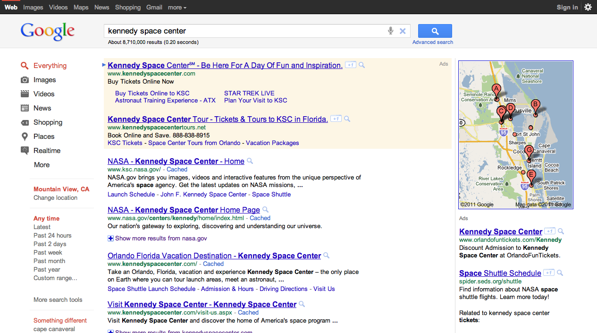
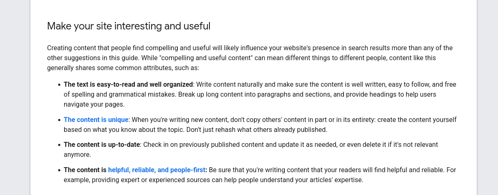
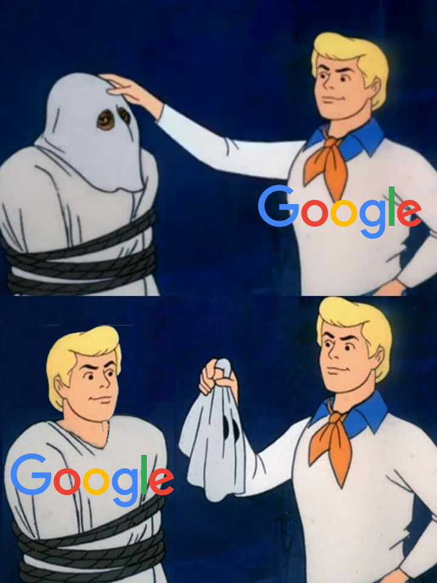

Google displaced other search engines by leveraging a simple, minimalistic interface and superior search algorithm. While its competitors were cluttered, ad-ridden web portals, Google had one specific purpose and it did it well.

This was what Google looked like then:

*Source: [Google Search Blog](https://search.googleblog.com/2011/06/some-updates-to-design-of-search.html)*

Today, Google’s search engine is partly an AI chatbot and partly a portal to Reddit. Ads are displayed prominently above the fold. The top search results are fluffy, long-form content ranking primarily because of the number of keywords and backlinks on the page. Despite the company's best efforts to convince us otherwise, Google cannot reliably infer content quality. Therefore, the algorithm has to make do with other less important and more easily faked signals.

Since businesses started getting on the Web, it has been a dance between Google and SEOs with each end trying to get the better of the other. Google would release a new algorithm update and SEO experts would try to reverse-engineer it based on their observations and opinions. 

These observations would become tactics and strategies and if you had a website that relied on getting traffic from Google, you had to pay attention. Occasionally, Google would release a guide with some helpful tips and some intentionally vague advice like “Make your site interesting and useful.” The company encouraged search engine optimization, as long as you didn't game the system. However, the simple truth is, that if there is a loophole, people will try to exploit it. 

*Source: [Google's SEO Starter Guide](https://developers.google.com/search/docs/fundamentals/seo-starter-guide)*

There have several SEO techniques over the years, ranging from straight keyword stuffing to image tags. However, the most prevalent by far has been publishing long-form content. SEOs figured out that the most reliable way to rank high on Google was to write the best article on the topic. 

It became common to see 2000+ word articles trying to cover every possible search intent with semantic keywords and unnecessary FAQ lists. Recipe pages would include long stories to convince the search algorithm that their content was the most in-depth and relevant. And the worst part (or best, depending on who you ask) is that it worked!

It worked because Google was too busy trying to keep the audience’s attention on the increasingly visible ads on the SERPs to ensure that webmasters were writing content for people and not their algorithm.

  


  <br/ >

Before the Helpful Content update, if you wrote a 3000-word article filled with semantic keywords and attention-grabbing images/videos, your article was guaranteed to rank. If your competitors caught up to you, you would add more words. Rinse and repeat. 

The system ran on for a while. A good number of web content writers got paid by the word and were incentivized to write more words. Businesses got to rank on the first page of Google, so they had no reason to change what worked. SEO experts and service providers were able to create a bloated and overpriced industry. But web users were getting the short end of the stick with fluffy, uninteresting, and arduous-to-read content that had forgotten who it was meant to serve.

You can't explicitly blame SEOs for the turn of events. Behind the scenes, Google has been focused on solving one problem: maximizing profit potential from ad revenue. Google was too busy stealing answers with featured snippets (later AI Overviews) from creators to notice the growing attention problem they had contributed to.

We can criticize SEOs for ruining the search experience but they were only playing the game, doing the exact thing Google was doing less openly. 

As early as 2019, savvy users discovered that adding ‘site:reddit.com’ or simply ‘Reddit’ to their searches was the best way to skip the ads and 2500-word articles to get the actual answer they were looking for. Perhaps if they had the resources, Reddit Inc. could have created a worthwhile competitor to Google Search. Google would later add a ‘Discussions and forums’ section in late 2022 and would begin boosting Reddit and Quora in 2023. 


  
In his popular piece <a href = "https://www.wheresyoured.at/the-men-who-killed-google">"The Man Who Killed Google Search"</a>, Ed Zitron posits a name he believes was responsible for the current of search: Prabhakar Raghavan. However, I am inclined to disagree. Scapegoats are very easy to find and the real problem likely runs much deeper.



*Let's see who is behind that mask*

At the end of the day, Google itself ruined Google Search and they have no current incentive to fix it. 

So, what can we do about it? We can start by using Google's proprietary products less, writing helpful content for people and promoting it actively. You can go a step further and install a custom ROM (LineageOS and /e/OS are good options) on your Android device to shake things up a bit. Between us and the LLM chatbots, I'd wager that we could go some damage to the conglomerate.

